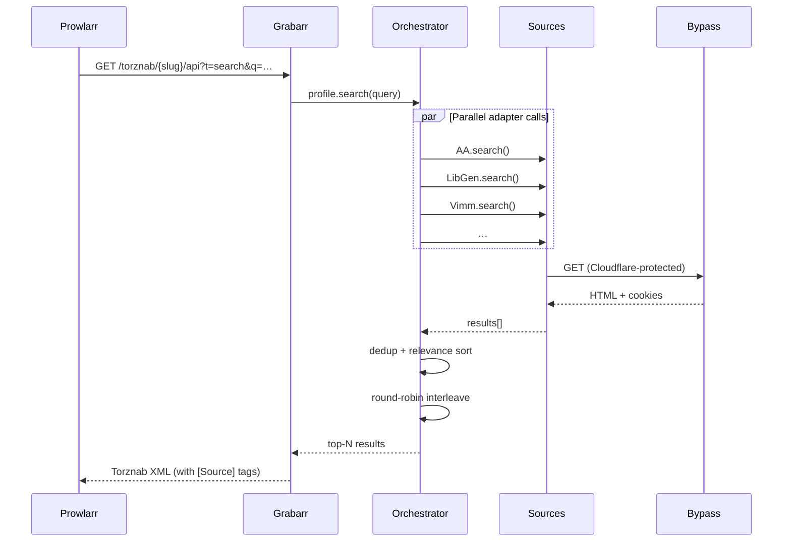
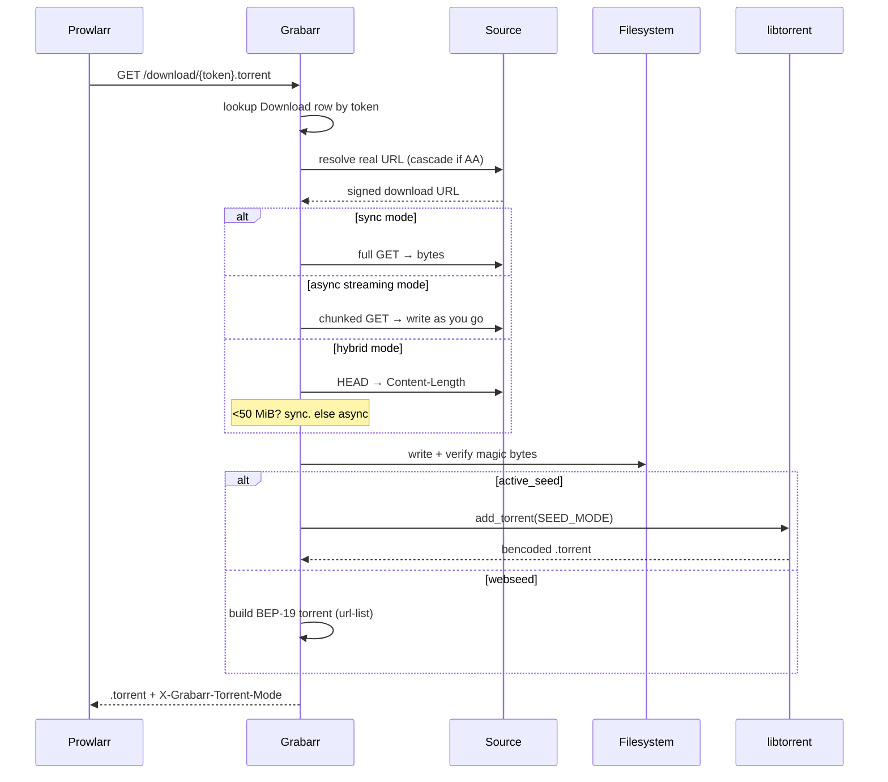

<div align="center">

# 📚 Grabarr

**The missing bridge between shadow libraries and the *arr ecosystem.**

[](https://github.com/sharkhunterr/grabarr/releases)
[](https://hub.docker.com/r/sharkhunterr/grabarr)
[](https://hub.docker.com/r/sharkhunterr/grabarr)
[](LICENSE)

[](https://python.org)
[](https://fastapi.tiangolo.com)
[](https://sqlalchemy.org)
[](https://libtorrent.org)
[](https://github.com/Sonarr/Sonarr/wiki/Implementing-a-Torznab-indexer)

**[Quick Start](#-quick-start)** •
**[Sources](#-sources)** •
**[Docker Hub](https://hub.docker.com/r/sharkhunterr/grabarr)** •
**[Architecture](#%EF%B8%8F-architecture)**

</div>

---

## 🚀 What is Grabarr?

Grabarr exposes shadow libraries (Anna's Archive, LibGen, Z-Library, Internet Archive) and ROM repositories (Vimm's Lair, Edge Emulation, RomsFun, CDRomance, MyAbandonware) as standard **Torznab indexers** consumable by **Prowlarr** and the *arr apps (Readarr, Mylar3, Bookshelf…). It downloads HTTP files server-side and emits seedable `.torrent` files on the fly so any BitTorrent client (Deluge, qBittorrent, Transmission, rTorrent) consumes them transparently.

**Perfect for:**
- 📚 Homelab owners running Readarr / Mylar3 / Bookshelf who want a public-domain or shadow-library backstop
- 🎮 Retrogamers who want their *arr stack to also reach into ROM repositories
- 🔌 Anyone who wants Cloudflare-protected sources behind a unified Torznab feed
- 🤖 Operators who want one indexer slot in Prowlarr to cover six+ upstream sites

> [!WARNING]
> **Vibe Coded Project** — this application was built **100% using AI-assisted development** with [Claude Code](https://claude.ai/code).

> [!IMPORTANT]
> **Heritage** — the AA / LibGen / Z-Library cascade is a verbatim vendor of [Shelfmark](https://github.com/calibrain/calibre-web-automated-book-downloader) v1.2.1 (MIT) under [`grabarr/vendor/shelfmark/`](grabarr/vendor/shelfmark/). Per Constitution Articles III + VII it is **not patched in place** — bugs there are fixed upstream and re-vendored.

---

## ✨ Features

<table>
<tr>
<td width="33%" valign="top">

### 🔌 Multi-Source Indexer
**9 upstreams, 1 Torznab feed**
- **Anna's Archive** + cascade
- **LibGen** (rotating mirrors)
- **Z-Library**
- **Internet Archive** (incl. romsets)
- **Vimm's Lair** (consoles)
- **Edge Emulation** (Atari, NES…)
- **RomsFun** (CF-protected)
- **CDRomance** + **MyAbandonware**

</td>
<td width="33%" valign="top">

### ☁️ Cloudflare Bypass
**Browser automation built-in**
- `internal` mode (SeleniumBase cdp_driver)
- `external` mode (FlareSolverr)
- `auto` fallback both
- Cookie + token rotation
- Click-driven captures
- Chromium + Xvfb in Docker

</td>
<td width="33%" valign="top">

### 🌱 Dual Torrent Modes
**Per-profile choice**
- **Active seed** — libtorrent session, real seeding on 45000-45100
- **Webseed** — pure-Python BEP-19 + url-list, no libtorrent needed
- **3 download modes** — sync / async streaming / hybrid (50 MiB threshold)
- Stable info-hashes for Prowlarr

</td>
</tr>
</table>

### 🧠 Smart Search Orchestration
- 🎯 Per-source `max_results` (default 20-30) with **top-relevance ranking**
- 🔁 Round-robin interleave + dedup across sources
- 🏷️ Mandatory `[Source]` prefix on result titles for Prowlarr clarity
- 🎮 Console / region / language / version metadata extraction (No-Intro, Hack, year)
- ⚙️ Console-name mapping configurable from the **web UI** (no code edits)

### 🛡️ Operator-Grade Reliability
- 🔍 Per-adapter **circuit breaker** (60 s health monitor)
- 🪦 **Zombie sweeper** at boot flips stuck downloads to `failed`
- 🔁 Apprise + generic-webhook notifications with flap suppression
- 🔐 Apprise URLs encrypted at rest with auto-generated Fernet key
- 📊 `/healthz` + Prometheus-style `/metrics` endpoints

### 🎨 Modern Web UI
- 🌓 Light/Dark theme via Tailwind
- 📱 Responsive, htmx-driven (no SPA bloat)
- 🔧 Profile editor with live source toggles + AA mirror editor
- 🔑 Per-profile API keys + Prowlarr quick-setup page

---

## 🏃 Quick Start

### Docker Compose (Recommended)

The image bundles **Chromium + Xvfb + ffmpeg** so the Cloudflare bypass works out of the box — no FlareSolverr sidecar needed. This is the most reliable path on networks that block CF mirrors at the DNS layer.

```yaml
services:
  grabarr:
    image: sharkhunterr/grabarr:latest
    container_name: grabarr
    ports:
      - "8080:8080"
      - "8999:8999"        # tracker stub
      - "45000-45100:45000-45100"  # libtorrent (active_seed mode)
    volumes:
      - ./data:/app/data
      - ./downloads:/app/downloads
    environment:
      - TZ=Europe/Paris
    dns:
      - 1.1.1.1
      - 8.8.8.8
    shm_size: 2gb
    restart: unless-stopped
```

```bash
docker compose up -d
```

**Access**: http://localhost:8080

### Local development

```bash
./start.sh                 # background, writes .grabarr.pid
./start.sh --foreground    # attached
./stop.sh                  # idempotent
HOST=127.0.0.1 ./start.sh  # bind local-only
```

> [!WARNING]
> **Always use the wrappers, never raw `uv run uvicorn`** — they redirect Shelfmark's hardcoded `/var/log/shelfmark` paths into `./data/shelfmark/`, kill stale instances on port 8080, and wait on `/healthz`.

---

## 🔧 Configuration

### Environment variables (boot-time only)

| Variable | Default | Description |
|----------|---------|-------------|
| `GRABARR_SERVER__HOST` | `0.0.0.0` | Bind address |
| `GRABARR_SERVER__PORT` | `8080` | HTTP port |
| `GRABARR_SERVER__DATA_DIR` | `./data` | DB + state |
| `GRABARR_SERVER__DOWNLOADS_DIR` | `./downloads` | Staging area |
| `GRABARR_TORRENT_MODE` | `active_seed` | `active_seed` or `webseed` |
| `GRABARR_BYPASS__MODE` | `auto` | `internal` / `external` / `auto` / `off` |
| `FLARESOLVERR_URL` | _unset_ | Wire an external bypasser |
| `GRABARR_MASTER_SECRET` | auto-generated | Fernet key for Apprise URLs |

UI-mutable settings (mirrors, AA donator key, source credentials, console maps…) live in the `settings` SQLite table behind the `settings_service` cache. See [docs/configuration.md](docs/configuration.md) for the full reference.

### First launch

1. **Open** http://localhost:8080 → **Profiles** → 7 default profiles are seeded
2. **Configure sources** — add credentials per adapter (AA donator key, Z-Library account, IA login if needed)
3. **Pick your bypass mode** — `internal` works out-of-box in Docker; on bare metal run `./install-deps.sh` first
4. **Add to Prowlarr** — for each profile, copy the Torznab URL from the **Prowlarr Setup** page

---

## 🎯 Sources

| Source | Type | Auth | CF? | Notes |
|--------|------|------|-----|-------|
| **Anna's Archive** | Books, papers | Optional donator key | Yes | Cascade fallback to LibGen + Z-Library |
| **LibGen** | Books | None | No | Multi-mirror with auto-rotation |
| **Z-Library** | Books, articles | Account required | No | Cookie-based session |
| **Internet Archive** | Public domain, romsets | Optional login | No | Drills into multi-file items |
| **Vimm's Lair** | Console ROMs | None | No | dl3.vimm.net direct media[] capture |
| **Edge Emulation** | Atari/NES/SMS ROMs | None | No | SHA-1 hashes extracted |
| **RomsFun** | Multi-platform ROMs | None | Yes | Click-driver token rotation |
| **CDRomance** | PC + console | None | Yes | "Show Links" AJAX capture |
| **MyAbandonware** | Vintage PC games | None | Yes | Captcha-aware download flow |

See [docs/DEVELOPING_ADAPTERS.md](docs/DEVELOPING_ADAPTERS.md) for adding your own.

---

## 🏗️ Architecture

```mermaid
flowchart TB
    subgraph Prowlarr["🔍 Prowlarr / *arr"]
        P[Prowlarr]
        R[Readarr / Mylar3 / Bookshelf]
    end

    subgraph Grabarr["⚙️ Grabarr :8080"]
        TZ[Torznab API]
        ORC[Profile<br/>Orchestrator]
        DLM[Download<br/>Manager]
        TG[.torrent<br/>Generator]
        TR[Tracker<br/>:8999]
        WS[Webseed<br/>Server]
    end

    subgraph Bypass["☁️ CF Bypass"]
        INT[Internal<br/>SeleniumBase]
        EXT[External<br/>FlareSolverr]
    end

    subgraph Sources["📚 Upstreams"]
        AA[Anna's Archive]
        LG[LibGen]
        ZL[Z-Library]
        IA[Internet Archive]
        ROMS[ROM sites<br/>Vimm/Edge/RomsFun…]
    end

    subgraph Client["🌱 Torrent client"]
        BT[Deluge / qBit /<br/>Transmission]
    end

    P -->|t=search| TZ
    TZ --> ORC
    ORC -->|parallel| AA & LG & ZL & IA & ROMS
    AA -.CF challenge.-> Bypass
    ROMS -.CF challenge.-> Bypass
    P -->|/download/{token}| TZ
    TZ --> DLM
    DLM --> TG
    TG --> BT
    BT -->|announce| TR
    BT -->|HTTP Range| WS
    R -->|imports finished| BT
```

### Search request flow



### Download request flow



---

## 🛠️ Technology Stack

| Layer | Technologies |
|-------|--------------|
| **Backend** | Python 3.12 • FastAPI (async) • SQLAlchemy 2.0 • Alembic • `uv` |
| **Frontend** | Jinja2 • Tailwind CSS • htmx • sortable.js • chart.js |
| **Torrents** | libtorrent 2.0 • pure-Python bencode + BEP-19 webseed |
| **Bypass** | SeleniumBase cdp_driver • Chromium • Xvfb • FlareSolverr (optional) |
| **Notifications** | Apprise • generic webhooks (Jinja2 body) |
| **DevOps** | Docker • GitLab CI (tag-only pipeline) • standard-version |

---

## 📦 Data & Backup

### Volumes

| Path | Content |
|------|---------|
| `/app/data/grabarr.db` | SQLite (profiles, downloads, settings, search tokens) |
| `/app/data/.fernet_key` | Master encryption key (auto-generated) |
| `/app/data/session.state` | libtorrent session state (active_seed mode) |
| `/app/data/shelfmark/` | Vendored Shelfmark logs + cache |
| `/app/downloads/incoming` | Staging during fetch |
| `/app/downloads/ready` | Verified files served via webseed / libtorrent |

### Reset helpers

```bash
./reset-downloads.sh         # wipes downloads, keeps profiles + settings
./use-public-dns.sh          # routes lookups through 1.1.1.1 / 8.8.8.8 / 9.9.9.9
./install-deps.sh            # local Chromium + Xvfb + ffmpeg for internal bypass
```

---

## 📚 Documentation

| Document | Purpose |
|----------|---------|
| [docs/configuration.md](docs/configuration.md) | Every settings key with default + override path |
| [docs/troubleshooting.md](docs/troubleshooting.md) | Symptom → cause → fix for common operator issues |
| [docs/DEVELOPING_ADAPTERS.md](docs/DEVELOPING_ADAPTERS.md) | Add a new source adapter |
| [docs/release/README.md](docs/release/README.md) | Release pipeline runbook (`npm run release:full`) |
| [CHANGELOG.md](CHANGELOG.md) | Versioned release notes |
| [.specify/memory/constitution.md](.specify/memory/constitution.md) | 16 articles + governance rules |

---

## 🤝 Contributing

Contributions welcome! Please:

1. Fork the repository
2. Create a feature branch
3. Run `make lint && make test`
4. Submit a pull request

> [!NOTE]
> **Don't patch `grabarr/vendor/shelfmark/`** — it's a verbatim vendor. Bugs there are fixed upstream and re-vendored with `make vendor-shelfmark`. Articles III + VII of the constitution.

---

## 🚫 Non-goals

Grabarr is **not** a download manager for end users, **not** a library manager, **not** a metadata provider, and does **not** redistribute content. See the constitution §"Scope Boundaries".

---

## 🙏 Acknowledgments

**The Need**: the *arr ecosystem is brilliant for media you can torrent, but books, papers, and ROMs live on HTTP-only shadow libraries that Prowlarr can't reach. Manually downloading and re-torrenting was tedious — and didn't scale beyond a handful of items.

**The Solution**: Grabarr was born to bridge HTTP-only sources to BitTorrent clients via the standard Torznab interface. Connect Prowlarr once, search across nine upstreams, and let your existing *arr stack import them like any other release.

**The Approach**: As a young parent with limited time and no fullstack development experience (neither backend nor frontend), traditional coding wasn't an option. Built entirely through [Claude Code](https://claude.ai/code) using "vibe coding" — pure conversation, no manual coding required.

Special thanks to the [Shelfmark](https://github.com/calibrain/calibre-web-automated-book-downloader) team for the open-source AA cascade that powers Grabarr's book sources.

---

## 📄 License

- **Grabarr's own code** — GPL-3.0-or-later. See [LICENSE](LICENSE).
- **Vendored Shelfmark** (`grabarr/vendor/shelfmark/`) — MIT. See [grabarr/vendor/shelfmark/ATTRIBUTION.md](grabarr/vendor/shelfmark/ATTRIBUTION.md).

---

<div align="center">

**Built with Claude Code 🤖 for the homelab community 🏠**

[](https://github.com/sharkhunterr/grabarr)
[](https://hub.docker.com/r/sharkhunterr/grabarr)

[⭐ Star on GitHub](https://github.com/sharkhunterr/grabarr) • [🐛 Report Bug](https://github.com/sharkhunterr/grabarr/issues) • [💡 Request Feature](https://github.com/sharkhunterr/grabarr/issues)

</div>
